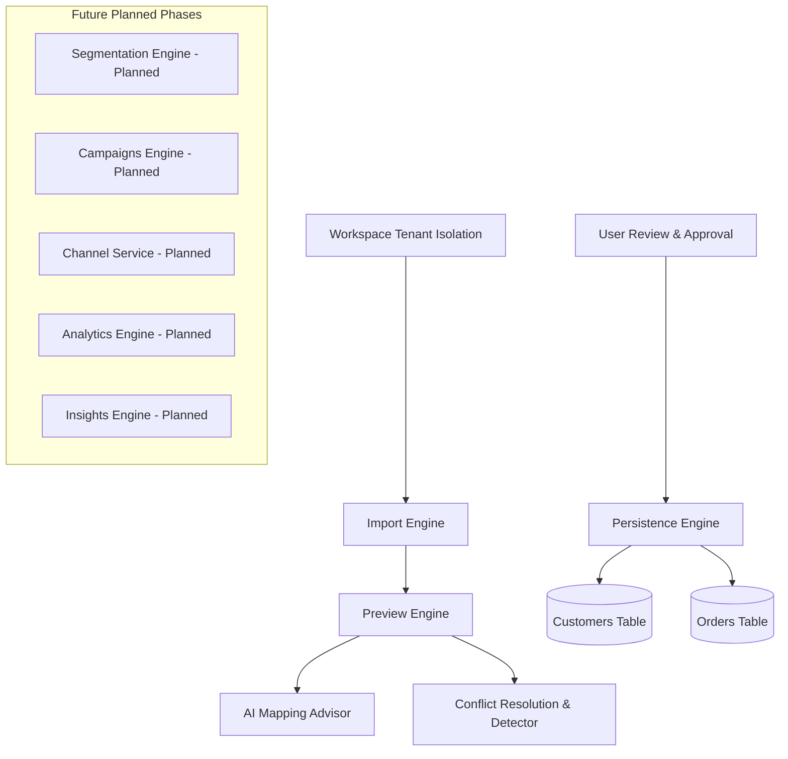
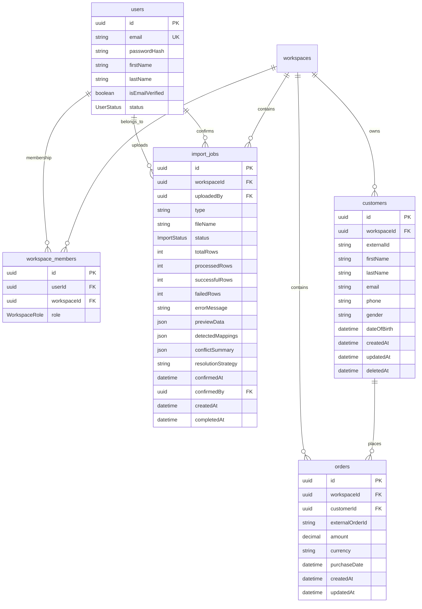
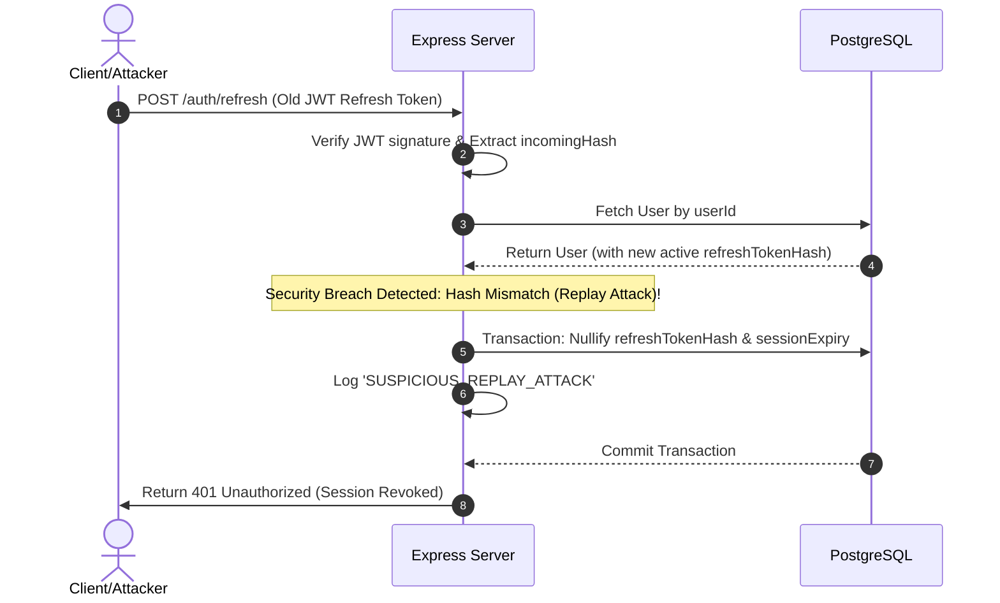

# System Architecture — XENO AI CRM Platform

This document details the architectural specifications, component boundaries, and security patterns implemented in the XENO AI CRM backend platform.

---

## 1. Directory Blueprint & Layered Architecture

The project enforces a strict Separation of Concerns (SoC). The core authentication engine resides under standard layered directories, while workspace-specific business systems reside in self-contained feature modules under `src/modules/`.

```
src/
├── app.js                   # Express application configuration and middleware registration
├── server.js                # Server entry point, configuration verification, and graceful shutdown handles
├── config/                  # Configuration loaders and database client instantiations
│   ├── env.js               # Strict environment variables loader using Zod parsing
│   └── database.js          # Prisma Client singleton
├── controllers/             # Layered HTTP Controllers (auth engine)
│   └── auth.controller.js
├── services/                # Layered business logic services (auth engine)
│   ├── auth.service.js
│   └── email.service.js
├── repositories/            # Layered database access (auth engine)
│   ├── user.repository.js
│   ├── session.repository.js
│   ├── token.repository.js
│   └── audit-log.repository.js
├── routes/                  # Layered API route declarations (auth engine)
│   └── auth.routes.js
├── middlewares/             # Express middlewares (security guards, rate limiters, error captures)
│   ├── auth.middleware.js
│   ├── error.middleware.js
│   ├── rate-limit.middleware.js
│   └── validation.middleware.js
├── modules/                 # Feature Module Directory (Workspace, Imports, Customers, Orders)
│   ├── workspace/           # Workspace & Membership Module
│   │   ├── workspace.controller.js
│   │   ├── workspace.middleware.js
│   │   ├── workspace.repository.js
│   │   ├── workspace.routes.js
│   │   ├── workspace.service.js
│   │   └── workspace.validation.js
│   ├── imports/             # CSV Data Ingestion Module
│   │   ├── import.controller.js
│   │   ├── import.repository.js
│   │   ├── import.routes.js
│   │   ├── import.service.js
│   │   ├── import.validation.js
│   │   └── utils/           # Parser, cleaners, and formatters
│   ├── customers/           # Customer Management Domain Module
│   │   ├── customer.repository.js
│   │   └── customer.service.js
│   └── orders/              # Order Management Domain Module
│       ├── order.repository.js
│       └── order.service.js
├── schemas/                 # Zod validation schema templates (auth engine)
│   └── auth.schema.js
├── utils/                   # Shared utility logic
│   ├── crypto.js            # Bcrypt, SHA-256 hashing, timing-safe compares, random generator
│   ├── errors.js            # Standard AppError classes
│   └── logger.js            # Pino logging configuration
└── lib/                     # Third-party integrations
    └── nodemailer.js        # SMTP email client instantiation
```

### Separation of Concerns (SoC)

| Layer | Responsibility | Inputs / Outputs |
| :--- | :--- | :--- |
| **Routing** | Directs HTTP verbs and routes to validation chains and controllers. | Request URL $\rightarrow$ Controller |
| **Middlewares** | Intercepts requests for rate-limiting, JWT parsing, workspace authorization, and validation. | Request $\rightarrow$ Sanitized Request |
| **Controllers** | Extracts HTTP properties (body, headers, query, client IP, User-Agent) and passes them to services. | HTTP Req $\rightarrow$ JSON Response |

## 2. Ingestion & Database Design

### Ingestion Engine Components
The CSV import subsystem has been redesigned into a modular multi-stage processing pipeline:



### Entity Relations Diagram



### Models Specification

#### User
- **UUID Keys**: Auto-generated Version 4 UUIDs.
- **Case-Insensitive Uniqueness**: Handled by lowercasing the email at validation boundaries.
- **Soft Delete Support**: Flagged via the `deletedAt` DateTime timestamp.

#### Workspace & WorkspaceMember
- **Tenant Isolation**: Serves as the primary security partition for all customer data, orders, and imports.
- **Role Control**: Memberships hold roles (`OWNER`, `ADMIN`, `MEMBER`) mapping administrative scopes.
- **Workspace-Scoped Uniqueness**: Prevent duplicate users per workspace via a composite unique constraint on `(userId, workspaceId)`.

#### ImportJob
- **State Machine tracking**: Transitions from `PENDING` $\rightarrow$ `PREVIEW_READY` $\rightarrow$ `CONFIRMED` $\rightarrow$ `PROCESSING` $\rightarrow$ `COMPLETED` or `FAILED`.
- **Ingestion Previews**: JSONB columns `previewData`, `detectedMappings`, and `conflictSummary` cache parsing metadata and detected conflicts prior to human confirmation.
- **Auditing**: Tracks `resolutionStrategy`, `confirmedAt`, and `confirmedBy` to ensure clear accountability.

#### Customer
- **Identifiers**: Multiple potential links via email or phone. 
- **Workspace-Scoped Uniqueness**: Composite unique keys on `(workspaceId, email)` and `(workspaceId, phone)` ensure brands keep clean independent records.

#### Order
- **Transactional Idempotency**: Handled using composite unique constraint on `(workspaceId, externalOrderId)`.
- **Decimal Amount**: Leverages exact Decimal columns to eliminate floating-point rounding errors.

---


## 3. Cryptography & Security Engineering

### Hashing Strategies
1. **Passwords**: Hashed using `bcrypt` with a cost factor of **12 rounds**, maintaining optimal resistance against brute-force attacks while fitting server responsiveness limits (<150ms processing time).
2. **Tokens**: High-entropy tokens (Refresh, Email, Reset) are generated using 32 bytes of secure random bytes (`crypto.randomBytes(32).toString('hex')`). They are hashed before database writes using `SHA-256` (`crypto.createHash('sha256')`).

### JWT Specifications
The platform issues dual JWT tokens (Access and Refresh) signed using standard HMAC SHA-256.

```
Access JWT (Short-Lived: 15 minutes)
└── Payload
    ├── sub: UUID (User ID)
    ├── email: string
    ├── role: USER | ADMIN | SUPER_ADMIN
    ├── iss: 'xeno-auth-issuer'
    └── aud: 'xeno-saas-audience'

Refresh JWT (Long-Lived: 7 days)
└── Payload
    ├── sub: UUID (User ID)
    ├── jti: UUID (Unique Token ID to prevent same-second generation collisions)
    ├── iss: 'xeno-auth-issuer'
    └── aud: 'xeno-saas-audience'
```

### Refresh Token Rotation (RTR) & Replay Prevention
To mitigate token theft, XENO enforces strict Refresh Token Rotation (RTR).

1. **Successful Rotation**:
   - The user requests a token rotation by sending their current JWT Refresh Token.
   - The server decodes the token, extracts the `sub` (userId), and fetches the user from the database.
   - The incoming token's SHA-256 hash is compared using `timingSafeCompare` with the database's stored `refreshTokenHash`.
   - Upon verification, a new JWT refresh token (with a new `jti`) is issued, and its hash is persisted in the User row, overwriting the old one.

2. **Replay Attack / Compromise Detection**:
   - If a client attempts to rotate a session using a hash that does NOT match the active `refreshTokenHash` (meaning they used an older, replaced refresh token), this indicates a replay attack.
   - The server immediately flags a `SUSPICIOUS_REPLAY_ATTACK` security breach.
   - The server revokes the active session by nullifying `refreshTokenHash` and `sessionExpiry`. The user is logged out immediately.



---

## 4. Error Handling (RFC 7807 Compliance)

Every application response returning a `4xx` or `5xx` status code conforms to the **RFC 7807 (Problem Details for HTTP APIs)** specification, providing uniform machine-readable JSON bodies.

### Header Specification
Responses are served with the header: `Content-Type: application/problem+json`.

### Payload Model
```json
{
  "type": "about:blank",
  "title": "Bad Request / Validation Error",
  "status": 400,
  "detail": "Request validation failed.",
  "instance": "/auth/signup",
  "errors": [
    {
      "field": "password",
      "message": "Password must contain at least one special character."
    }
  ]
}
```

---

## 5. Observability & Graceful Shutdown

### Pino Logger Configuration
- **Redaction**: System blocks logging of `password`, `passwordHash`, `token`, `refreshToken`, `accessToken`, `secret` (supports nested objects like `body.password`).
- **Log Events**:
  - `USER_SIGNUP`: Tracked with userId and email.
  - `USER_LOGIN`: Tracks IP, User-Agent, and sessionId.
  - `SUSPICIOUS_REPLAY_ATTACK`: Logs severity `error` containing sessionId and IP coordinates.
  - `EMAIL_DISPATCH`: Logs success/failure states of Nodemailer SMTP requests.

### Graceful Shutdown
To prevent request dropouts and DB record corruptions during application deployments or restarts:
1. **SIGINT/SIGTERM Traps**: Intercepted by `server.js`.
2. **HTTP socket closure**: Express stops listening and stops accepting incoming connections.
3. **Database separation**: `prisma.$disconnect()` is invoked only after in-flight requests complete processing.
4. **Kill Switch Safeguard**: 10-second timeout forcefully exits the Node process if connections hang.
