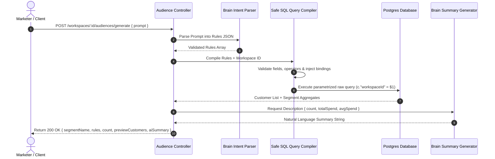

# Audience Intelligence & Safe SQL Compilation

This document provides a technical walkthrough of the Audience Intelligence module. It outlines the hybrid approach to audience generation, the rules-based SQL compiler, the LLM simulation details, and multi-tenant isolation guarantees.

---

## 1. Hybrid Intent Ingest Model

To deliver a reliable, marketer-friendly segmentation experience, the platform supports a dual-input model:

1. **Predefined Marketing Goals**: Fixed-form options that are instantly resolved to high-intent rules.
   - *Example*: `"Reward loyal customers"`, `"Re-engage dormant customers"`, `"Target high-value customers"`, or `"Clean up inactive emails"`.
2. **Free-form Natural Language Prompts**: Marketers can write arbitrary queries that get interpreted by our intent parser.
   - *Example*: `"Show me active buyers from Mumbai who spend on skincare."`

### Processing Lifecycle Flow



---

## 2. Mock AI Intent Parser & Summary Generator

### Intent Parser (`src/brain/intent-parser/index.js`)

The AI module simulates LLM behavior by mapping natural language prompts to structured query configurations. The simulator enforces strict formatting rules and is designed to replicate production characteristics:

- **Predefined Goal Resolvers**:
  - `"Reward loyal customers"` $\rightarrow$ `orderCount >= 5`
  - `"Re-engage dormant customers"` $\rightarrow$ `lastPurchaseDays >= 90`
  - `"Target high-value customers"` $\rightarrow$ `totalSpend >= 10000`
  - `"Clean up inactive emails"` $\rightarrow$ `lastPurchaseDays >= 180`
- **Keyword Processing Engine**:
  - Searches for city keywords (e.g., `"Mumbai"`, `"Bangalore"`, `"Delhi"`) $\rightarrow$ generates a `city = [keyword]` filter.
  - Searches for categories (e.g., `"skincare"`, `"electronics"`, `"apparel"`) $\rightarrow$ generates a `category = [keyword]` filter.
  - Searches for frequency keywords (e.g., `"twice"`) $\rightarrow$ generates `purchaseFrequency >= 2`.
  - Searches for recency indicators (e.g., `"last 30 days"`, `"last 45 days"`) $\rightarrow$ generates corresponding recency operators.
- **Fail-Safe & Test Conditions**:
  - If a prompt contains `"trigger_invalid_json"`, the simulator returns non-JSON text to verify that the Express app catches parser errors.
  - If a prompt contains `"trigger_invalid_operator"`, it returns an invalid SQL operator (e.g., `LIKE%`) to test rule schema verification.
  - If a prompt contains `"trigger_invalid_field"`, it returns a schema field not supported by the system (e.g., `userRating`) to test security safeguards.

### Summary Generator (`src/brain/summary-generator/index.js`)

Produces localized, human-friendly descriptions of the generated segment using aggregate figures:
- Automatically formats summary sentences based on customer matches.
- Injects city name details, average deal values, and recency counts dynamically.

---

## 3. Safe Query Compiler

The system compiles rules to SQL safely to prevent SQL injection vulnerabilities.

> [!IMPORTANT]
> **No Direct SQL Execution by AI**
> The simulated LLM outputs a structured rules JSON payload. It NEVER generates or executes raw SQL strings. The translation to SQL happens entirely inside our backend compiler using strict parameter binding.

### Safe Query Compiler Blueprint (`src/shared/query-builder/queryBuilder.js`)

The compiler implements a strict whitelist structure:

1. **Allowed Columns & Fields**:
   - `totalSpend` (Aggregated order amount)
   - `lastPurchaseDays` (Days elapsed since most recent order date)
   - `purchaseFrequency` (Unique external order count)
   - `city` (Customer registration city)
   - `category` (Order item category classification)
   - `orderCount` (Alias of `purchaseFrequency`)
   - `averageOrderValue` (Average transaction size)
   - `firstPurchaseDays` (Days elapsed since oldest purchase)
   - `discountUsage` (Has utilized a discount coupon)

2. **Allowed Operators**:
   - Numeric & recency: `>`, `<`, `>=`, `<=`, `=`
   - Categorical / Text: `=`, `IN`

3. **Parametrization & SQL Injection Prevention**:
   Instead of concatenating string literals directly into queries, the compiler aggregates parameters into a sequential array (`$1`, `$2`, `$3`, ...) and binds them.

```javascript
// Parameter binding translation example
const whereClause = [];
const params = [workspaceId]; // $1 represents workspaceId

if (rule.field === 'city') {
  params.push(rule.value); // Add city value to params array
  whereClause.push(`c."city" = $${params.length}`); // Generates c."city" = $2
}
```

4. **Column Identifier Double-Quoting**:
   Prisma builds default tables and fields using camelCase (`workspaceId`, `purchaseDate`, etc.). PostgreSQL folds unquoted column names to lowercase by default. To prevent syntax errors, all identifiers in raw queries must be double-quoted (e.g., `o."workspaceId"`, `o."purchaseDate"`).

---

## 4. Multi-Tenant Database Isolation

Tenant isolation is verified at the database query layer. Every segment query enforces workspace filtering using the primary workspace ID parameter binding:

```sql
SELECT c.id, c."firstName", c."lastName", c.email, c.city,
       COALESCE(SUM(o.amount), 0) as "totalSpend",
       COALESCE(COUNT(o.id), 0) as "orderCount",
       EXTRACT(DAY FROM (NOW() - MAX(o."purchaseDate"))) as "lastPurchaseDays"
FROM customers c
LEFT JOIN orders o ON o."customerId" = c.id
WHERE c."workspaceId" = $1 -- STRICT isolation parameter bind
GROUP BY c.id
HAVING ...
```

This prevents queries from Workspace A from retrieving or analyzing transaction statistics belonging to Workspace B, even if rules are malformed or injected.

---

## 5. Zod Response Validation Contracts

To guarantee system stability, all API communication is strictly validated:

### 1. Generating Audiences Schema
- **Payload**:
  - `prompt`: String, required, min 3 characters, max 1000 characters.

### 2. Segment Creation Schema
- **Payload**:
  - `name`: String, required, min 3 characters, max 100 characters.
  - `description`: String, optional, max 500 characters.
  - `rules`: Array of Rules objects containing:
    - `field`: Enumerated whitelist field.
    - `operator`: Enumerated whitelist operator.
    - `value`: Supported primitive type value (String, Number, Boolean, or Array).

---

## 6. Segment Lifecycle

1. **Generation Preview**: Marketers request segment counts and client previews without database persistence (`POST /workspaces/:workspaceId/audiences/generate`).
2. **Persistence**: The segment and its component rules are saved under the workspace tenant context (`POST /workspaces/:workspaceId/segments`).
3. **Retrieval**: List or fetch saved configurations with historical counts and parameters (`GET /workspaces/:workspaceId/segments` and `GET /workspaces/:workspaceId/segments/:segmentId`).
4. **Execution Preview**: Re-execute saved filters on current live database records to fetch active client lists (`GET /workspaces/:workspaceId/segments/:segmentId/preview`).
