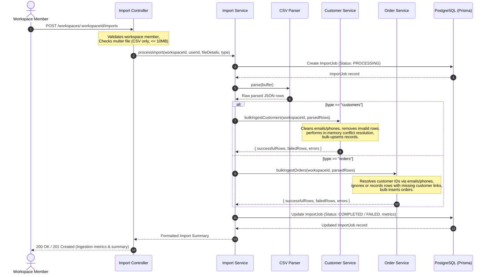
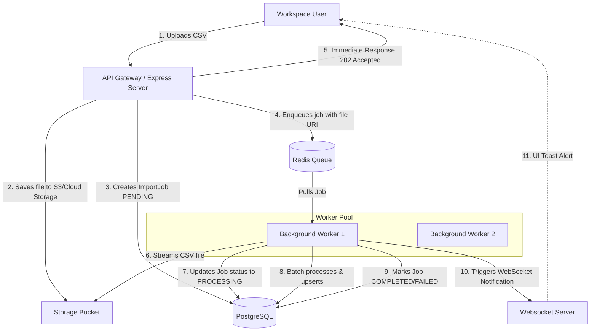

# Import Infrastructure & Pipeline

This document details the CSV Import Infrastructure and Pipeline, representing Phase 3 of the XENO backend architecture.

---

## 1. Overview
The import system allows workspace users to upload structured customer and order data in CSV format to quickly bootstrap their workspace tenants. 
This ingestion foundation is designed to validate, sanitize, and persist files up to **10MB** sequentially (synchronously) in the current iteration, with a clear path to asynchronous background worker queues.

---

## 2. Ingestion Flow & Lifecycle

The lifecycle of an import operation proceeds as follows:



---

## 3. Database Schema

```prisma
enum ImportStatus {
  PENDING
  PROCESSING
  COMPLETED
  FAILED
}

model ImportJob {
  id             String       @id @default(uuid()) @db.Uuid
  workspaceId    String       @db.Uuid
  uploadedBy     String       @db.Uuid
  type           String       // "customers" | "orders"
  fileName       String
  status         ImportStatus @default(PENDING)
  totalRows      Int          @default(0)
  processedRows  Int          @default(0)
  successfulRows Int          @default(0)
  failedRows     Int          @default(0)
  errorMessage   String?
  createdAt      DateTime     @default(now())
  completedAt    DateTime?

  workspace Workspace @relation(fields: [workspaceId], references: [id], onDelete: Cascade)
  user      User      @relation(fields: [uploadedBy], references: [id], onDelete: Cascade)

  @@index([workspaceId])
  @@index([uploadedBy])
  @@index([status])
  @@index([createdAt])
  @@map("import_jobs")
}
```

---

## 4. Architectural Tradeoffs: Synchronous vs. Asynchronous Queues

Currently, imports are processed **synchronously** within the HTTP request cycle. This choice was made for:
1. **Simplicity and Direct Feedback**: Users get instant confirmation and verification summaries in the HTTP response.
2. **Minimal Infrastructure Footprint**: Eliminates the immediate need for Redis and background worker instances for small-scale operations.

### Production Scalability Constraints (Why Sync is a Tradeoff)
* **Request Timeout Limits**: Large files (>5MB or near the 10MB limit) can hit API gateway (e.g. Nginx, AWS ALB) or Express request timeout thresholds (typically 30s - 120s).
* **Event Loop Blocking**: CSV parsing and validation are CPU-intensive operations. Running large parse tasks blocking the Node.js event loop degrades API responsiveness for all other users.
* **Memory Spikes**: Buffering the entire CSV file and loading massive arrays of objects into memory simultaneously risks crashing the container due to Out-Of-Memory (OOM) limits.

### Path to Asynchronous Scaling (Proposed Queue Design)
For production-grade scalability, XENO will transition to an **asynchronous queue architecture** using **BullMQ** or **Bee-Queue** backed by **Redis**:



#### Key Changes in the Async Pipeline:
1. **Stream-based Processing**: Instead of reading the entire file into memory, use Node.js streams (`csv-parse` stream API) to read and process the file in batches (e.g., 500 records at a time).
2. **Dedicated Workers**: Offload processing to a separate cluster of CPU-optimized Docker containers running worker processes.
3. **Optimistic HTTP Accepted (202)**: Instantly return an import job ID with a status of `PENDING` so the client UI can poll the job or wait for a WebSocket notification.
