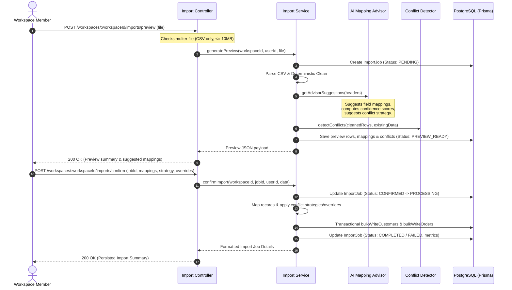

# AI-Assisted Single Dataset Import Ingestion Pipeline

This document details the CSV Import Infrastructure and Pipeline, representing Phase 3 of the XENO backend architecture.

---

## 1. Overview
The import system allows workspace users to upload a single sales export CSV (e.g. from Shopify, WooCommerce, POS, etc.) containing both customer and order data, quickly bootstrapping their workspace.

Rather than persisting data blindly, this system operates on a **Human-in-the-loop (HITL)** principle:
1. **Preview**: The user uploads a CSV. The system parses it, cleans it deterministically, detects conflicts, and runs an AI Mapping Advisor to suggest mappings and strategies. No data is saved to customers or orders.
2. **Review & Confirm**: The user reviews mapping suggestions, resolves detected conflicts, selects global or per-record strategies, and approves the import.
3. **Persist**: The system writes customers and orders transactionally under the selected strategies.

---

## 2. Ingestion Flow & Lifecycle

The lifecycle of an import operation proceeds as follows:



---

## 3. Conflict Resolution Strategies

When customer or order conflicts occur (e.g. customer with matching email/phone already exists in the workspace), three strategies are supported:
- **`KEEP_EXISTING`** (Default): Database records win. The system does not overwrite existing data, but will backfill missing/null database fields with incoming values.
- **`UPDATE_EXISTING`**: Incoming CSV records win. The system overwrites database fields with incoming values.
- **`SKIP`**: The incoming row is ignored entirely (no customer updates and no order is written).

### Record-Level Overrides
Users can pass an array of `overrides` specifying per-record strategies matching on customer email, phone, or order ID:
```json
{
  "resolutionStrategy": "KEEP_EXISTING",
  "overrides": [
    {
      "identifier": "override-customer@buyer.com",
      "strategy": "UPDATE_EXISTING"
    }
  ]
}
```

---

## 4. Architectural Tradeoffs & Future Scaling

Currently, preview generation and persistence are handled **synchronously** within the HTTP cycle.

### Constraints of the Synchronous Approach:
* **Request Timeout Limits**: Large files (>5MB) can hit gateway timeouts.
* **Event Loop Blocking**: CSV parsing, validation, and in-memory conflict sorting are CPU-bound and can block the event loop.
* **Memory Limits**: Large datasets buffered in-memory risk OOM crashes.

### Path to Asynchronous Scaling:
For production-grade scalability, XENO will migrate this Preview & Confirm pipeline to an asynchronous queue backed by Redis:
1. **Upload CSV**: The UI uploads the CSV file. The server saves it to S3/Cloud Storage, creates a `PENDING` ImportJob, and enqueues a background job. The server returns 202 Accepted.
2. **Preview Processing**: A background worker pulls the job, downloads/streams the CSV, generates preview data, writes it to the database, and marks the job `PREVIEW_READY`. WebSockets notify the UI.
3. **Confirm & Persist**: The user confirms the preview. The UI sends the confirmation payload. The server creates a confirmation queue task, immediately returning 202 Accepted. The worker applies strategies and performs batch database transactions.
