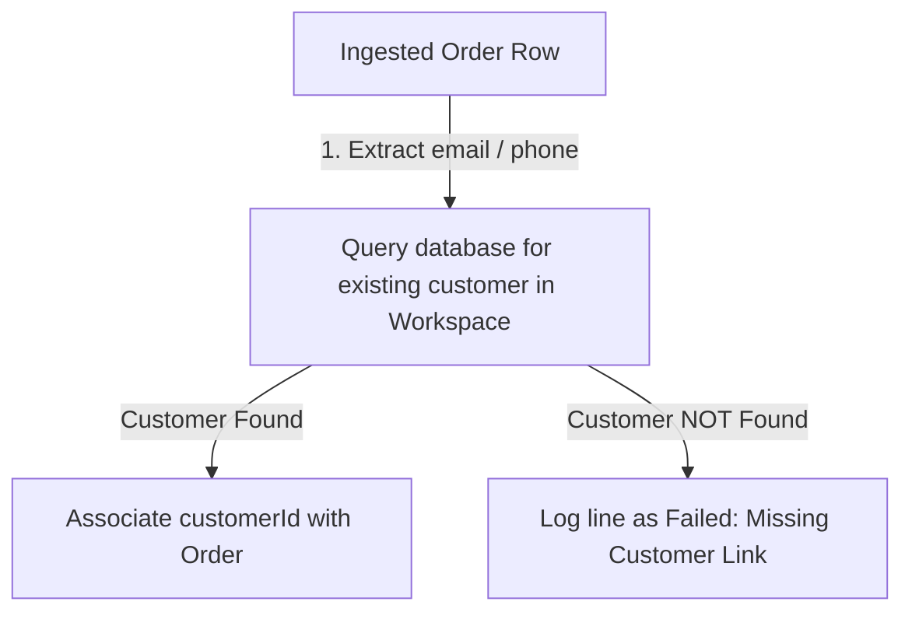

# Order Domain

This document describes the Order model, validation rules, customer linking mechanics, and deduplication strategies implemented in XENO.

---

## 1. Database Schema

```prisma
model Order {
  id              String   @id @default(uuid()) @db.Uuid
  workspaceId     String   @db.Uuid
  customerId      String   @db.Uuid
  externalOrderId String?
  amount          Decimal  @db.Decimal(10, 2)
  currency        String   @default("INR")
  purchaseDate    DateTime
  createdAt       DateTime @default(now())
  updatedAt       DateTime @updatedAt

  workspace Workspace @relation(fields: [workspaceId], references: [id], onDelete: Cascade)
  customer  Customer  @relation(fields: [customerId], references: [id], onDelete: Cascade)

  @@unique([workspaceId, externalOrderId])
  @@index([workspaceId])
  @@index([customerId])
  @@index([purchaseDate])
  @@map("orders")
}
```

### Key Schema Level Guarantees:
* **Multi-Tenant Isolation**: Every order belongs to a `workspaceId`.
* **Workspace-Scoped Order Uniqueness**: The `externalOrderId` (e.g., Shopify/Magento Order ID) must be unique within the workspace (`@@unique([workspaceId, externalOrderId])`).
* **Decimal Precision**: Order amounts are stored as exact decimal numbers (`Decimal(10, 2)`) to prevent floating-point rounding errors typical of double/float types in financial data.

---

## 2. Validation & Normalization Rules

| Field | CSV Column Header | Validation & Cleaning Rule |
| :--- | :--- | :--- |
| `externalOrderId` | `external_order_id` or `order_id` | Optional. Trimmed. Standardizes the order identifier from the source system. |
| `amount` | `amount` or `total` | **Required**. Must parse to a positive number. Formatted to two decimal places. Invalid numbers reject the row. |
| `currency` | `currency` | Optional. Defaults to `INR` if empty. Standardized to 3-character uppercase ISO code. |
| `purchaseDate` | `purchase_date` or `date` | **Required**. Must parse into a valid ISO DateTime format. Invalid dates reject the row. |
| `customerEmail` | `customer_email` or `email` | **Required (at least one of Email or Phone)**. Used to resolve the customer relationship. |
| `customerPhone` | `customer_phone` or `phone` | **Required (at least one of Email or Phone)**. Used to resolve the customer relationship. |

---

## 3. Customer Linking Logic

An order cannot exist in isolation; it MUST be linked to a customer record. When processing a batch of orders, XENO resolves this relationship dynamically using the provided customer identifier (`email` or `phone`):



### Linking Order:
1. **Query Batching**: Rather than executing a separate query for each order row (which causes severe database performance degradation), the service extracts all unique emails and phones from the order list.
2. **Bulk Fetch**: A single query fetches all matching customer records in the current workspace.
3. **Link Assignment**: The system maps each order to the correct `customerId`. If no customer matches the email or phone, the row is marked as **failed** with an appropriate validation message.

---

## 4. Deduplication & Idempotency

* **Idempotency Guarantee**: If an order has an `externalOrderId`, it is checked against existing orders in the database.
* **Ignore Duplicates**: If a record with the same `externalOrderId` already exists in the workspace, the row is ignored (considered successfully parsed/idempotent or flagged as a skip), preventing duplicate transaction records and inflated sales analytics.
* **Bulk Insertion**: Validated and deduplicated orders are inserted in batches using a single database operation (`createMany`) to ensure high-throughput processing.
